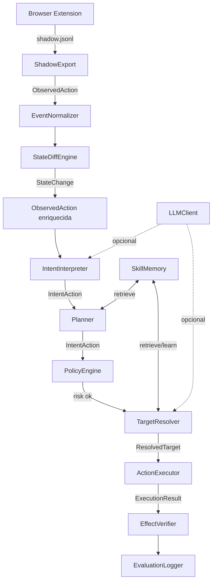
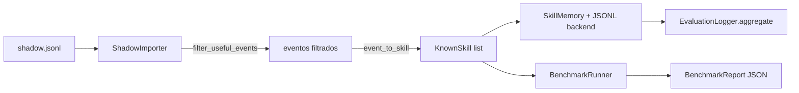
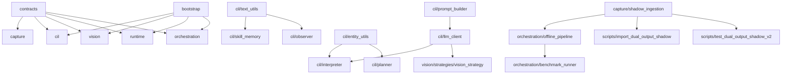

# Design Document — enterprise-semantic-automation

## Overview

Este documento descreve o design técnico para evoluir o sistema de automação semântica de UI ao nível enterprise. O sistema implementa um pipeline de seis estágios: **Captura → Normalização → Interpretação Semântica → Resolução de Alvo → Execução → Verificação de Efeito**, orquestrado pelo `ShadowModeRunner` em modo shadow e pelo novo `OfflinePipeline` para processamento offline de arquivos `.jsonl`.

As mudanças endereçam 17 requisitos agrupados em quatro eixos:
1. **Corretude estrutural** — DomStrategy, StateDiffEngine, EffectVerifier, Planner, VisionStrategy
2. **Consolidação de código** — ShadowImporter, entity_utils, text_utils, bootstrap factory
3. **Persistência e observabilidade** — SkillMemory JSONL backend, EvaluationLogger métricas, BenchmarkRunner
4. **Cobertura de testes** — contratos Pydantic, integração end-to-end, property-based tests


## Architecture

### Pipeline Principal (modo online)



### Pipeline Offline (sem browser)



### Dependências entre módulos (após refatoração)




## Components and Interfaces

### 1. `capture/shadow_ingestion.py` — ShadowImporter (novo)

Módulo unificado que substitui o código duplicado entre os dois scripts. Expõe API pública estável.

```python
# API pública
def load_jsonl(path: Path) -> list[dict]: ...
def filter_useful_events(events: list[dict]) -> list[dict]: ...
def normalize_goal_type(event: dict) -> str: ...
def normalize_fingerprint(event: dict) -> str: ...
def event_to_skill(event: dict) -> dict: ...
def write_skills(skills: list[dict], out_path: Path) -> None: ...
```

Os scripts `import_dual_output_shadow.py` e `test_dual_output_shadow_v2.py` passam a importar e delegar para este módulo, mantendo apenas a lógica de CLI (argparse, print_summary, try_project_integration).

**Decisão de design:** manter `compact()` como função interna do módulo (não exposta), pois é um detalhe de implementação.

---

### 2. `cil/text_utils.py` — TextNormalizer e SimilarityMatcher (novo)

```python
class TextNormalizer:
    @staticmethod
    def normalize(text: str) -> str:
        # lowercase → remove acentos unicode (unicodedata.normalize NFKD) → colapso de espaços → strip
        ...

class SimilarityMatcher:
    def __init__(self, algorithm: str = "sequence_matcher"):
        # algoritmo padrão: difflib.SequenceMatcher (sem dependência externa)
        ...

    def score(self, a: str, b: str) -> float:
        # normaliza ambos antes de comparar; retorna float em [0.0, 1.0]
        ...
```

**Decisão de design:** usar `difflib.SequenceMatcher` como padrão para evitar dependência externa. A interface `algorithm` permite trocar por `rapidfuzz` ou `Levenshtein` via configuração futura.

---

### 3. `cil/entity_utils.py` — inferência de entidade de negócio (novo)

```python
def infer_business_entity(blob: str) -> str | None:
    # extrai entidade de negócio de um texto concatenado
    # regras: cliente, fornecedor, pedido, documento/ged, filial
    ...
```

Elimina a duplicação entre `IntentInterpreter._infer_business_entity` e `Planner._infer_entity_from_objective`. Ambos passam a chamar esta função.

---

### 4. `cil/llm_client.py` — LLMClient (novo)

```python
class LLMClient:
    def __init__(
        self,
        model: str = os.getenv("LLM_MODEL", "gpt-4o-mini"),
        temperature: float = float(os.getenv("LLM_TEMPERATURE", "0.0")),
        timeout: int = int(os.getenv("LLM_TIMEOUT_S", "15")),
        prompt_builder: PromptBuilder | None = None,
    ): ...

    async def infer_visual(
        self, page, intent: IntentAction, state: ScreenState
    ) -> dict | None:
        # usa PromptBuilder.build_intent_prompt → chama LLM → parseia JSON
        # captura exceções e retorna None em caso de falha
        ...

    async def infer_intent(
        self, observed: ObservedAction, state: ScreenState
    ) -> dict | None:
        # retorna dict com goal_type, business_entity, expected_effect ou None
        ...
```

Configuração via variáveis de ambiente: `LLM_MODEL`, `LLM_TEMPERATURE`, `LLM_TIMEOUT_S`, `LLM_API_KEY`.

---

### 5. `vision/strategies/dom_strategy.py` — correção de selector

O `ResolvedNode.selector` deve ser um locator serializável pelo Playwright, não um pseudo-selector `semantic:*`.

| Método de resolução | Formato correto do selector |
|---|---|
| `page.get_by_role(role, name=text)` | `role=button[name="Salvar"]` |
| `page.get_by_label(text)` | `label=Nome do campo` |
| `page.get_by_placeholder(text)` | `placeholder=Digite aqui` |

O `ActionExecutor` usa `page.locator(selector)` para executar a ação, portanto o formato deve ser compatível com a API de locators do Playwright.

---

### 6. `cil/skill_memory.py` — backend de persistência

```python
class SkillBackend(Protocol):
    def load(self) -> list[KnownSkill]: ...
    def save(self, skills: list[KnownSkill]) -> None: ...

class JsonlSkillBackend:
    def __init__(self, path: Path): ...
    def load(self) -> list[KnownSkill]: ...   # ignora linhas malformadas com warning
    def save(self, skills: list[KnownSkill]) -> None: ...

class SkillMemory:
    def __init__(
        self,
        backend: SkillBackend | None = None,
        similarity_threshold: float = 0.7,
    ): ...
    def seed(self, skills: list[KnownSkill]) -> None: ...
    def retrieve(self, state: ScreenState, intent: IntentAction) -> list[KnownSkill]: ...
    def learn(self, intent, result, preferred_selector=None) -> KnownSkill | None: ...
```

O método `retrieve()` passa a usar `TextNormalizer` + `SimilarityMatcher` em vez de substring matching. O threshold padrão é 0.7.

---

### 7. `capture/state_diff.py` — detecção de grid_refresh e toast

```python
class StateDiffEngine:
    def __init__(
        self,
        grid_selectors: list[str] = ["tr[data-row]", ".p-datatable-row", ".ag-row"],
        toast_selectors: list[str] = [".p-toast-message", ".toast-message", "[role='alert']"],
    ): ...

    async def detect_live(self, page_before_snapshot: dict, page_after_snapshot: dict) -> StateChange:
        # recebe dicts com chaves: url, title, modal_open, grid_row_count, toast_present
        ...

    def detect(self, before: dict, after: dict) -> StateChange:
        # versão síncrona para uso offline (sem page)
        # prioridade: navigation > modal_open > modal_close > toast > grid_refresh > title_change > none
        ...
```

Os snapshots passam a incluir `grid_row_count: int` e `toast_present: bool`, coletados pelo `ScreenObserver` ou injetados em testes.

---

### 8. `runtime/effect_verifier.py` — verificação de grid_refresh e toast

```python
class EffectVerifier:
    def verify(
        self,
        intent: IntentAction,
        before: ScreenSnapshot,
        after: ScreenSnapshot,
        state_change: StateChange | None = None,
    ) -> tuple[bool, str]:
        # se state_change fornecido, usa diretamente
        # caso contrário, deriva da comparação before/after
        # cobre: navigation, modal_open, modal_close, grid_refresh, toast_visible
        ...
```

O `state_change` como parâmetro opcional desacopla a detecção da verificação, permitindo que o `StateDiffEngine` seja chamado separadamente.

---

### 9. `cil/planner.py` — histórico real e loop detection

```python
class Planner:
    def next_action(
        self,
        objective: str,
        state: ScreenState,
        history: list[IntentAction],
        known_skills: list[KnownSkill],
    ) -> IntentAction:
        # 1. detecta loop: mesmo semantic_target 3+ vezes consecutivas no histórico
        # 2. se loop: retorna navigate com target diferente + "loop_detected" no trace
        # 3. senão: aplica regras por goal_type (search, fill, confirm, save, open, select, navigate)
        # 4. prioriza known_skills de maior confidence quando disponíveis
        ...

    def _detect_loop(self, history: list[IntentAction]) -> bool: ...
    def _pick_alternative_target(self, state: ScreenState, history: list[IntentAction]) -> str: ...
```

Regras suportadas (≥7): `search`, `fill`, `confirm`, `save`, `open`, `select`, `navigate`, `delete`, `filter`.

---

### 10. `cil/interpreter.py` — integração com LLMClient

```python
class IntentInterpreter:
    def __init__(
        self,
        llm_client: LLMClient | None = None,
        flags: FeatureFlags | None = None,
    ): ...

    def interpret(self, observed: ObservedAction, state: ScreenState) -> IntentAction:
        # se llm_client e flags.use_llm_interpretation: tenta LLM, fallback para heurísticas
        # senão: usa heurísticas existentes
        ...
```

---

### 11. `cil/observer.py` — fingerprint normalizado

```python
class ScreenObserver:
    def _build_fingerprint(self, url, title, modal_open, hints, primary_area) -> str:
        # remove query params da URL antes de incluir
        # normaliza url e title com TextNormalizer
        # inclui primary_area quando disponível
        # formato: "<url_sem_query>::<title_norm>::modal=<0|1>::<primary_area>::<hints>"
        ...
```

---

### 12. `runtime/session_bootstrap.py` — login real

```python
class AuthenticationError(Exception): ...

class SessionBootstrap:
    async def login(self, page, cfg: SessionConfig) -> None:
        # preenche campo de usuário (seletor: input[name="username"] ou aria-label)
        # preenche campo de senha
        # submete formulário
        # aguarda networkidle ou seletor de dashboard
        # detecta MFA: se campo MFA presente, aguarda SENIOR_MFA_CODE por até 60s
        # lança AuthenticationError se seletor de erro de login aparecer
        # lança TimeoutError se não completar em 30s
        ...
```

---

### 13. `orchestration/evaluation_logger.py` — métricas agregadas

```python
class EvaluationLogger:
    def append(self, record: dict) -> str:
        # corrige bug: adiciona "\n" ao final de cada linha
        ...

    def aggregate(self, date: str | None = None) -> dict:
        # lê arquivo JSONL do dia
        # retorna: total_executions, success_rate, effect_verified_rate,
        #          strategy_distribution, avg_duration_ms, p95_duration_ms
        ...

    def export_csv(self, date: str | None, out_path: Path) -> None: ...
```

---

### 14. `orchestration/offline_pipeline.py` — pipeline offline (novo)

```python
class ImportReport(TypedDict):
    total_events: int
    useful_events: int
    skills_generated: int
    skills_discarded: int

class OfflinePipeline:
    def __init__(self, skill_memory: SkillMemory, min_confidence: float = 0.5): ...

    def run(self, jsonl_path: Path) -> tuple[list[KnownSkill], ImportReport]:
        # usa ShadowImporter para load → filter → event_to_skill
        # descarta skills com confidence < min_confidence
        # persiste no SkillMemory
        # retorna skills + relatório
        ...

# Ponto de entrada CLI:
# python -m orchestration.offline_pipeline <arquivo.jsonl>
```

---

### 15. `orchestration/benchmark_runner.py` — BenchmarkRunner (novo)

```python
class BenchmarkCase(TypedDict):
    objective: str
    shadow_jsonl_path: str
    expected_skills: list[dict]  # lista de {semantic_target, goal_type}

class CaseResult(TypedDict):
    case_objective: str
    precision: float
    recall: float
    f1_score: float
    passed: bool

class BenchmarkReport(TypedDict):
    timestamp: str
    total_cases: int
    passed: int
    failed: int
    precision: float
    recall: float
    f1_score: float
    cases: list[CaseResult]

class BenchmarkRunner:
    def __init__(self, offline_pipeline: OfflinePipeline, matcher: SimilarityMatcher): ...

    def run(self, cases: list[BenchmarkCase]) -> BenchmarkReport:
        # processa cada caso via OfflinePipeline
        # compara skills geradas com expected_skills via SimilarityMatcher
        # calcula precision, recall, f1 por caso e agregado
        # persiste em runtime_artifacts/benchmarks/<timestamp>_benchmark.json
        ...

# python -m orchestration.benchmark_runner <suite.json>
```

---

### 16. `bootstrap/__init__.py` — factory create_pipeline

```python
def create_pipeline(flags: FeatureFlags | None = None) -> dict:
    # retorna dict com chaves:
    # skill_memory, resolver, interpreter, planner,
    # effect_verifier, evaluation_logger, shadow_runner
    # inclui VisionStrategy na chain se flags.use_strategy_vision
    ...
```

---

### 17. `config/feature_flags.py` — novo campo

```python
@dataclass(frozen=True)
class FeatureFlags:
    # ... campos existentes ...
    use_llm_interpretation: bool = _flag("USE_LLM_INTERPRETATION", False)
```


## Data Models

### Modelos existentes (sem alteração de schema)

- `ObservedAction`, `RawTarget`, `StateChange`, `ScreenSnapshot`, `Artifacts` — `contracts/observed_action.py`
- `IntentAction`, `ExpectedEffect` — `contracts/intent_action.py`
- `ResolvedTarget`, `ResolvedNode`, `ResolutionEvidence` — `contracts/resolved_target.py`
- `ExecutionResult`, `ExecutionTelemetry` — `contracts/execution_result.py`
- `KnownSkill` — `contracts/known_skill.py`
- `ScreenState`, `VisibleElementHint` — `contracts/screen_state.py`

### Extensões de schema necessárias

**`ScreenSnapshot`** (em `contracts/observed_action.py`) — adicionar campos para suporte ao StateDiffEngine:
```python
class ScreenSnapshot(BaseModel):
    # campos existentes ...
    grid_row_count: int = 0        # novo: contagem de linhas de grid
    toast_present: bool = False    # novo: presença de toast/alert
```

**`StateChange`** — o tipo `"screen_change"` não existe no Literal atual; o código usa `"navigation"` para mudança de URL e `"field_update"` para campos. Nenhuma alteração necessária — os tipos `"grid_refresh"` e `"toast"` já estão no Literal.

### Novos modelos de dados

**`ImportReport`** (TypedDict em `orchestration/offline_pipeline.py`):
```python
class ImportReport(TypedDict):
    total_events: int
    useful_events: int
    skills_generated: int
    skills_discarded: int
```

**`BenchmarkCase`**, **`CaseResult`**, **`BenchmarkReport`** (TypedDicts em `orchestration/benchmark_runner.py`) — ver seção Components.

**`SessionConfig`** (dataclass existente em `runtime/session_bootstrap.py`) — sem alteração.

### Formato do arquivo JSONL de persistência de skills

Cada linha é um JSON serializado de `KnownSkill.model_dump()`:
```json
{"skill_id": "skill_abc123", "semantic_target": "Pesquisar documento", "goal_type": "search", "screen_fingerprint": "GED | Documentos", "preferred_selector": "role=button[name=\"Pesquisar\"]", "preferred_iframe": null, "confidence": 0.91, "source": "runtime_learning"}
```

### Formato do arquivo JSONL de avaliação

Cada linha é um JSON com a estrutura produzida por `ShadowModeRunner.run_from_observed_action()`:
```json
{"event_id": "...", "intent": {...}, "risk": {...}, "resolved_target": {...}, "execution_result": {...}, "trace": [...], "comparison": {...}}
```


## Correctness Properties

*A property is a characteristic or behavior that should hold true across all valid executions of a system — essentially, a formal statement about what the system should do. Properties serve as the bridge between human-readable specifications and machine-verifiable correctness guarantees.*

---

### Property 1: DomStrategy nunca produz selector com prefixo `semantic:`

*Para qualquer* texto de alvo não-vazio, o `ResolvedNode.selector` produzido pela `DomStrategy` nunca deve começar com o prefixo `"semantic:"` — deve ser um locator serializável no formato `role=`, `label=` ou `placeholder=`.

**Validates: Requirements 1.1, 1.2, 1.3, 1.4**

---

### Property 2: Equivalência do ShadowImporter com implementações originais

*Para qualquer* evento de shadow válido (dict com campos `semantic_action`, `business_target`, `elemento_alvo`, `technical`), `ShadowImporter.normalize_goal_type(event)` e `ShadowImporter.normalize_fingerprint(event)` devem produzir os mesmos resultados que as implementações originais dos dois scripts duplicados.

**Validates: Requirements 2.5**

---

### Property 3: Round-trip de persistência do SkillMemory

*Para qualquer* lista de `KnownSkill`, após `backend.save(skills)` seguido de `backend.load()`, a lista retornada deve conter os mesmos `skill_id` e campos que a lista original.

**Validates: Requirements 3.7**

---

### Property 4: SkillMemory chama backend.load() na inicialização

*Para qualquer* backend de persistência que retorne uma lista de skills, ao inicializar `SkillMemory(backend=backend)`, o método `retrieve()` deve encontrar as skills carregadas pelo backend sem necessidade de chamar `seed()` explicitamente.

**Validates: Requirements 3.2**

---

### Property 5: SkillMemory chama backend.save() após learn()

*Para qualquer* `IntentAction` e `ExecutionResult` com `status="success"`, após `SkillMemory.learn()`, o backend deve ter sido chamado com uma lista que contém a nova skill.

**Validates: Requirements 3.3**

---

### Property 6: StateDiffEngine detecta toast quando presente apenas no after

*Para qualquer* par de snapshots onde `toast_present=False` no before e `toast_present=True` no after, `StateDiffEngine.detect()` deve retornar `StateChange(changed=True, change_type="toast")`.

**Validates: Requirements 4.1**

---

### Property 7: StateDiffEngine detecta grid_refresh quando contagem de linhas muda

*Para qualquer* par de snapshots onde `grid_row_count` difere entre before e after, `StateDiffEngine.detect()` deve retornar `StateChange(changed=True, change_type="grid_refresh")`.

**Validates: Requirements 4.2**

---

### Property 8: StateDiffEngine com snapshots idênticos retorna none

*Para qualquer* snapshot, `StateDiffEngine.detect(s, s)` deve retornar `StateChange(changed=False, change_type="none")`.

**Validates: Requirements 4.3, 4.6**

---

### Property 9: EffectVerifier confirma grid_refresh e toast independente de URL/título

*Para qualquer* `IntentAction` com `expected_effect.effect_type` igual a `"grid_refresh"` (ou `"toast_visible"`), quando o `StateChange` fornecido tiver `change_type` correspondente, `EffectVerifier.verify()` deve retornar `(True, _)` independentemente dos valores de URL e título nos snapshots.

**Validates: Requirements 5.1, 5.2, 5.5**

---

### Property 10: EffectVerifier retorna False quando StateChange não corresponde ao efeito esperado

*Para qualquer* `IntentAction` com `expected_effect.effect_type = X` e `StateChange` com `change_type = Y` onde `X ≠ Y` (e Y não implica X), `EffectVerifier.verify()` deve retornar `(False, _)`.

**Validates: Requirements 5.3**

---

### Property 11: Planner detecta loop e diverge o semantic_target

*Para qualquer* histórico onde o mesmo `semantic_target` aparece 3 ou mais vezes consecutivas, `Planner.next_action()` deve retornar uma `IntentAction` cujo `semantic_target` seja diferente do target repetido e cujo `reasoning_trace` contenha `"loop_detected"`.

**Validates: Requirements 6.1, 6.2, 6.7**

---

### Property 12: Planner prioriza skill de maior confidence

*Para qualquer* objetivo e lista de `known_skills` com pelo menos uma skill cujo `goal_type` corresponde ao objetivo, `Planner.next_action()` deve retornar uma `IntentAction` cujo `semantic_target` seja igual ao `semantic_target` da skill de maior `confidence` nessa lista.

**Validates: Requirements 6.4**

---

### Property 13: IntentInterpreter sem LLM produz resultado idêntico ao comportamento atual

*Para qualquer* `ObservedAction` e `ScreenState`, `IntentInterpreter(llm_client=None).interpret()` deve produzir uma `IntentAction` com os mesmos `goal_type`, `semantic_target` e `business_entity` que a implementação heurística atual.

**Validates: Requirements 8.3**

---

### Property 14: SimilarityMatcher é simétrico

*Para qualquer* par de strings `(a, b)`, `SimilarityMatcher.score(a, b)` deve ser igual a `SimilarityMatcher.score(b, a)`.

**Validates: Requirements 10.7**

---

### Property 15: SimilarityMatcher retorna 1.0 para strings idênticas

*Para qualquer* string `s`, `SimilarityMatcher.score(s, s)` deve retornar `1.0`.

**Validates: Requirements 10.8**

---

### Property 16: SimilarityMatcher retorna float em [0.0, 1.0]

*Para qualquer* par de strings `(a, b)`, `SimilarityMatcher.score(a, b)` deve retornar um valor no intervalo `[0.0, 1.0]`.

**Validates: Requirements 10.2**

---

### Property 17: TextNormalizer é idempotente

*Para qualquer* string `s`, `TextNormalizer.normalize(TextNormalizer.normalize(s))` deve ser igual a `TextNormalizer.normalize(s)`.

**Validates: Requirements 10.1**

---

### Property 18: ScreenObserver produz fingerprint estável sem query params

*Para qualquer* URL com parâmetros de query variáveis (ex: `?t=<timestamp>`), duas chamadas a `_build_fingerprint` com a mesma URL base mas timestamps diferentes devem produzir o mesmo fingerprint.

**Validates: Requirements 11.3, 11.4**

---

### Property 19: ScreenObserver inclui primary_area no fingerprint

*Para qualquer* observação onde `primary_area` é não-nulo, o fingerprint produzido deve conter o valor de `primary_area`.

**Validates: Requirements 11.2**

---

### Property 20: EvaluationLogger.aggregate() conta corretamente N registros

*Para qualquer* arquivo JSONL com N registros válidos appendados via `EvaluationLogger.append()`, `EvaluationLogger.aggregate()` deve retornar `total_executions == N`, e o arquivo deve ter exatamente N linhas não-vazias.

**Validates: Requirements 13.2, 13.4, 13.6**

---

### Property 21: BenchmarkReport contém todos os campos obrigatórios

*Para qualquer* lista de `BenchmarkCase` (incluindo lista vazia), `BenchmarkRunner.run()` deve retornar um `BenchmarkReport` com os campos `total_cases`, `passed`, `failed`, `precision`, `recall`, `f1_score` e `cases` presentes e com tipos corretos.

**Validates: Requirements 14.3**

---

### Property 22: Round-trip de serialização dos modelos Pydantic

*Para qualquer* instância válida de `ExecutionResult`, `IntentAction`, `ObservedAction` ou `ResolvedTarget`, `Model.model_validate(model.model_dump())` deve retornar um objeto equivalente ao original (todos os campos com os mesmos valores).

**Validates: Requirements 15.1, 15.2, 15.3, 15.4, 15.5**

---

### Property 23: OfflinePipeline gera relatório com campos corretos

*Para qualquer* arquivo `.jsonl` válido (incluindo arquivo vazio), `OfflinePipeline.run()` deve retornar um `ImportReport` com os campos `total_events`, `useful_events`, `skills_generated` e `skills_discarded` presentes, onde `useful_events <= total_events` e `skills_generated + skills_discarded == useful_events`.

**Validates: Requirements 9.5**


## Error Handling

### Hierarquia de exceções novas

```python
# runtime/session_bootstrap.py
class AuthenticationError(Exception): ...   # credenciais inválidas
class MFATimeoutError(TimeoutError): ...    # MFA não fornecido a tempo

# orchestration/offline_pipeline.py
class PipelineInputError(ValueError): ...   # arquivo .jsonl não encontrado
```

### Estratégias por componente

| Componente | Situação de erro | Estratégia |
|---|---|---|
| `JsonlSkillBackend.load()` | Linha JSON malformada | Log warning + skip linha; não lança exceção |
| `JsonlSkillBackend.load()` | Arquivo não existe | Retorna lista vazia |
| `LLMClient.infer_visual()` | Exceção de rede/timeout | Log error + retorna `None` |
| `LLMClient.infer_intent()` | Resposta sem campos esperados | Retorna `None` |
| `IntentInterpreter.interpret()` | LLM falha | Fallback para heurísticas + `"llm_fallback"` no trace |
| `VisionStrategy.try_resolve()` | LLM retorna `None` ou sem `coords_rel` | Retorna `None` (próxima strategy tenta) |
| `TargetResolver.resolve()` | Todas as strategies falham | Lança `RuntimeError` com `intent_id` |
| `SessionBootstrap.login()` | Seletor de erro de login detectado | Lança `AuthenticationError` |
| `SessionBootstrap.login()` | Timeout de 30s | Lança `TimeoutError` |
| `OfflinePipeline.run()` | Arquivo não existe | Lança `PipelineInputError`; CLI imprime stderr + exit 1 |
| `EvaluationLogger.aggregate()` | Arquivo JSONL não existe | Retorna dict com campos zerados |
| `StateDiffEngine.detect()` | Snapshots `None` | Trata como dicts vazios; retorna `StateChange(changed=False)` |

### Logging

Todos os componentes usam `logging.getLogger(__name__)`. Níveis:
- `WARNING`: dados ignorados (linhas malformadas, skills descartadas)
- `ERROR`: falhas de LLM, falhas de autenticação
- `DEBUG`: trace de resolução de alvo, detalhes de fingerprint


## Testing Strategy

### Abordagem dual: testes unitários + property-based tests

Os testes unitários cobrem exemplos específicos, casos de borda e pontos de integração. Os property-based tests verificam propriedades universais com entradas geradas aleatoriamente. Ambos são complementares e necessários.

**Biblioteca de property-based testing:** [`hypothesis`](https://hypothesis.readthedocs.io/) (Python). Já disponível no ecossistema Python sem dependência adicional pesada.

**Configuração mínima:** cada property test deve rodar com `@settings(max_examples=100)`.

**Tag de rastreabilidade:** cada property test deve ter um comentário no formato:
```python
# Feature: enterprise-semantic-automation, Property N: <texto da propriedade>
```

---

### Estrutura de testes

```
tests/
  conftest.py                    ← fixtures globais (ObservedAction, ScreenState, etc.)
  contracts/
    test_execution_result.py     ← Property 22 (round-trip) + exemplos de validação
    test_intent_action.py        ← Property 22 + exemplos de validação
    test_observed_action.py      ← Property 22 + exemplos de validação
    test_resolved_target.py      ← Property 22 + exemplos de validação
  capture/
    test_state_diff.py           ← Properties 6, 7, 8 + exemplos
    test_shadow_ingestion.py     ← Property 2 + exemplos de API pública
  cil/
    test_text_utils.py           ← Properties 14, 15, 16, 17
    test_skill_memory.py         ← Properties 3, 4, 5 + exemplos
    test_interpreter.py          ← Property 13 + exemplos
    test_planner.py              ← Properties 11, 12 + exemplos
    test_observer.py             ← Properties 18, 19
  vision/
    test_dom_strategy.py         ← Property 1 + exemplo de integração (1.5)
  runtime/
    test_effect_verifier.py      ← Properties 9, 10
  orchestration/
    test_evaluation_logger.py    ← Property 20 + exemplos
    test_offline_pipeline.py     ← Property 23 + exemplos
    test_benchmark_runner.py     ← Property 21 + exemplos
  integration/
    test_pipeline_e2e.py         ← fluxo completo com mocks de page
    test_offline_pipeline_e2e.py ← OfflinePipeline com fixture shadow.jsonl
```

---

### Fixtures globais (`tests/conftest.py`)

```python
@pytest.fixture
def sample_observed_action() -> ObservedAction:
    # ObservedAction válido com RawTarget mínimo, reutilizável por todos os testes

@pytest.fixture
def sample_screen_state() -> ScreenState:
    # ScreenState com fingerprint, primary_area e visible_hints

@pytest.fixture
def sample_intent_action() -> IntentAction:
    # IntentAction com goal_type="search" e expected_effect

@pytest.fixture
def shadow_jsonl_fixture(tmp_path) -> Path:
    # cria arquivo .jsonl temporário com 3 eventos válidos e 1 is_noise=True
```

---

### Property tests detalhados

**Property 1 — DomStrategy selector format** (`tests/vision/test_dom_strategy.py`):
```python
# Feature: enterprise-semantic-automation, Property 1: DomStrategy nunca produz selector com prefixo semantic:
@given(target_text=st.text(min_size=1, max_size=50).filter(str.strip))
@settings(max_examples=100)
async def test_dom_strategy_selector_never_semantic(target_text):
    # mock page que retorna count=1 para get_by_role
    # verifica que resolved_target.resolved_target.selector não começa com "semantic:"
```

**Property 3 — SkillMemory round-trip** (`tests/cil/test_skill_memory.py`):
```python
# Feature: enterprise-semantic-automation, Property 3: Round-trip de persistência do SkillMemory
@given(skills=st.lists(skill_strategy(), min_size=0, max_size=20))
@settings(max_examples=100)
def test_skill_memory_persistence_round_trip(skills, tmp_path):
    backend = JsonlSkillBackend(tmp_path / "skills.jsonl")
    backend.save(skills)
    loaded = backend.load()
    assert {s.skill_id for s in loaded} == {s.skill_id for s in skills}
```

**Properties 14, 15, 16 — SimilarityMatcher** (`tests/cil/test_text_utils.py`):
```python
# Feature: enterprise-semantic-automation, Property 14: SimilarityMatcher é simétrico
@given(a=st.text(), b=st.text())
@settings(max_examples=100)
def test_similarity_symmetric(a, b):
    assert SimilarityMatcher().score(a, b) == SimilarityMatcher().score(b, a)

# Feature: enterprise-semantic-automation, Property 15: SimilarityMatcher retorna 1.0 para strings idênticas
@given(s=st.text())
@settings(max_examples=100)
def test_similarity_identity(s):
    assert SimilarityMatcher().score(s, s) == 1.0

# Feature: enterprise-semantic-automation, Property 16: SimilarityMatcher retorna float em [0.0, 1.0]
@given(a=st.text(), b=st.text())
@settings(max_examples=100)
def test_similarity_range(a, b):
    score = SimilarityMatcher().score(a, b)
    assert 0.0 <= score <= 1.0
```

**Property 22 — Pydantic round-trip** (`tests/contracts/`):
```python
# Feature: enterprise-semantic-automation, Property 22: Round-trip de serialização dos modelos Pydantic
@given(instance=st.builds(ExecutionResult, ...))
@settings(max_examples=100)
def test_execution_result_round_trip(instance):
    assert ExecutionResult.model_validate(instance.model_dump()) == instance
```

---

### Testes de integração (`tests/integration/`)

**`test_pipeline_e2e.py`**: usa `AsyncMock` para simular `page` do Playwright. Exercita o fluxo completo `ObservedAction → IntentInterpreter → SkillMemory.retrieve → DomStrategy (mock page) → EffectVerifier`. Não requer browser real. Deve completar em < 5s.

**`test_offline_pipeline_e2e.py`**: usa o fixture `shadow_jsonl_fixture` para exercitar `OfflinePipeline.run()` com arquivo real. Verifica que skills são geradas e persistidas no `JsonlSkillBackend`. Deve completar em < 2s.

---

### Testes unitários — foco em exemplos e casos de borda

- **`test_state_diff.py`**: exemplos de cada `change_type` (navigation, modal_open, modal_close, grid_refresh, toast, none)
- **`test_planner.py`**: histórico vazio, histórico com loop, objetivo com `fill`, `confirm`, `save`
- **`test_session_bootstrap.py`**: mock de page com seletor de erro → `AuthenticationError`; mock com timeout → `TimeoutError`
- **`test_evaluation_logger.py`**: arquivo inexistente → dict zerado; N appends → N linhas no arquivo
- **`test_shadow_ingestion.py`**: evento com `is_noise=True` filtrado; evento sem `business_target` filtrado; evento vazio

