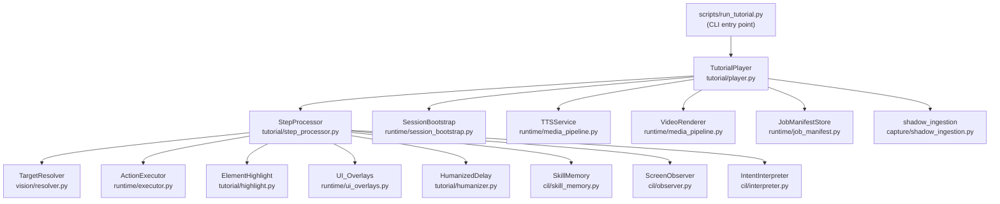
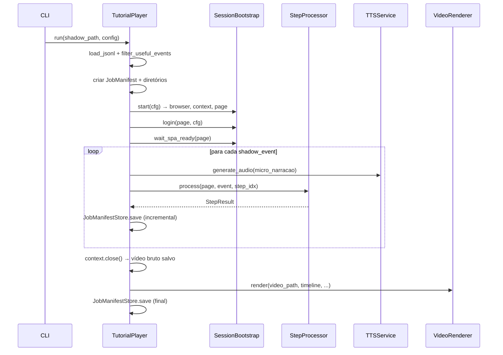

# Design Document — Tutorial Player

## Overview

O Tutorial Player é um orquestrador de reprodução de sessões capturadas que consome arquivos `shadow.jsonl` e os reproduz no browser do Senior X de forma humanizada. Ele reutiliza toda a infraestrutura existente (`ActionExecutor`, `TargetResolver`, `TTSService`, `VideoRenderer`, `SessionBootstrap`, `UI_Overlays`, `JobManifest`) e adiciona três novos componentes: `TutorialPlayer`, `StepProcessor`, `ElementHighlight` e `HumanizedDelay`.

O sistema opera em três modos mutuamente exclusivos:

| Modo | Navegação | Overlays | ActionExecutor | Delay |
|------|-----------|----------|----------------|-------|
| `--replay` (padrão) | sim | sim | sim | humanizado |
| `--guide` | sim | sim | não | humanizado |
| `--record-only` | sim | não | não | fixo 2s |

Ao final de cada sessão, o sistema produz: vídeo MP4 com áudio TTS sincronizado, arquivo SRT de legendas e JobManifest JSON em `runtime_artifacts/tutorials/{job_id}/`.

---

## Architecture



### Fluxo de execução principal



---

## Components and Interfaces

### TutorialPlayer (`tutorial/player.py`)

Orquestrador principal. Responsável pelo ciclo de vida completo da sessão.

```python
@dataclass
class TutorialConfig:
    shadow_path: Path
    mode: Literal["replay", "guide", "record-only"] = "replay"
    headless: bool = False
    min_step_duration: float = 1.5
    speed_factor: float = 1.0
    max_events: int = 0
    senior_url: str = ""

class TutorialPlayer:
    def __init__(self, config: TutorialConfig, skill_memory: SkillMemory) -> None: ...
    async def run(self) -> JobManifest: ...
    async def _setup_session(self) -> tuple[Browser, BrowserContext, Page]: ...
    async def _teardown_session(self, context: BrowserContext) -> str: ...  # retorna video_path
    async def _render_final_video(self, manifest: JobManifest) -> None: ...
    def _build_artifact_paths(self, job_id: str) -> ArtifactPaths: ...
```

### StepProcessor (`tutorial/step_processor.py`)

Processa um único `shadow_event`. Encapsula toda a lógica de um Step: navegação, resolução, highlight, overlay, execução e delay.

```python
@dataclass
class StepResult:
    step_index: int
    event_id: str
    status: Literal["success", "resolution_failed", "execution_partial", "skipped"]
    audio_file: Optional[str]
    audio_duration: float
    strategy_used: Optional[str]
    error: Optional[str]

class StepProcessor:
    def __init__(
        self,
        mode: Literal["replay", "guide", "record-only"],
        resolver: TargetResolver,
        executor: ActionExecutor,
        highlight: ElementHighlight,
        observer: ScreenObserver,
        interpreter: IntentInterpreter,
        skill_memory: SkillMemory,
        humanizer: HumanizedDelay,
    ) -> None: ...

    async def process(
        self,
        page: Page,
        event: dict,
        step_index: int,
        total_steps: int,
        lesson_name: str,
        audio_file: Optional[str],
        audio_duration: float,
    ) -> StepResult: ...

    async def _navigate_if_needed(self, page: Page, event: dict) -> None: ...
    def _build_intent(self, event: dict, state: ScreenState) -> IntentAction: ...
    def _build_observed(self, event: dict) -> ObservedAction: ...
```

### ElementHighlight (`tutorial/highlight.py`)

Injeta e remove o highlight visual sobre o elemento-alvo via JavaScript.

```python
class ElementHighlight:
    HIGHLIGHT_COLOR = "#FF6B35"
    Z_INDEX = 2147483644

    async def inject(
        self,
        page_or_frame,
        coords_rel: Optional[RelativeBox],
        selector: Optional[str] = None,
    ) -> None: ...

    async def remove(self, page_or_frame) -> None: ...

    def _build_inject_script(
        self, x_pct: float, y_pct: float, w_pct: float, h_pct: float
    ) -> str: ...
```

O script JS calcula posição absoluta a partir das coordenadas relativas:
```javascript
const x = x_pct * window.innerWidth;
const y = y_pct * window.innerHeight;
const w = w_pct * window.innerWidth;
const h = h_pct * window.innerHeight;
// cria div com position:fixed, left:x, top:y, width:w, height:h
// border: 3px solid #FF6B35, border-radius: 4px
// box-shadow: 0 0 0 4px rgba(255,107,53,0.3)
// z-index: 2147483644
```

### HumanizedDelay (`tutorial/humanizer.py`)

Calcula e aplica delays naturais entre Steps.

```python
class HumanizedDelay:
    def __init__(
        self,
        min_step_duration: float = 1.5,
        speed_factor: float = 1.0,
        rng: Optional[random.Random] = None,
    ) -> None: ...

    def calculate(self, audio_duration: float) -> float:
        """Retorna max(audio_duration, min_step_duration) + jitter, * speed_factor."""
        ...

    async def wait(self, audio_duration: float) -> None:
        """Calcula e aplica o delay via asyncio.sleep."""
        ...
```

### CLI (`scripts/run_tutorial.py`)

Entry point com argparse. Constrói `TutorialConfig`, instancia `TutorialPlayer` e executa `asyncio.run(player.run())`.

---

## Data Models

### ArtifactPaths

```python
@dataclass
class ArtifactPaths:
    root: Path                  # runtime_artifacts/tutorials/{job_id}/
    audio_dir: Path             # root/audio/
    raw_dir: Path               # root/raw/
    output_mp4: Path            # root/{job_id}.mp4
    output_srt: Path            # root/{job_id}.srt
    manifest_copy: Path         # root/{job_id}_manifest.json
```

### StepRecord (adicionado ao JobManifest via extensão)

O `JobManifest` existente é usado diretamente. O campo `audio_timeline` acumula `TimelineAudioItem` por Step. Para rastreabilidade de status por Step, o `TutorialPlayer` mantém uma lista interna `step_records: list[StepResult]` que é serializada no manifest final.

### Mapeamento shadow_event → IntentAction

| Campo shadow_event | Campo IntentAction |
|---|---|
| `business_target` | `semantic_target` |
| `semantic_action` (via `normalize_goal_type`) | `goal_type` |
| `micro_narracao` | `pedagogical_value` |
| `contexto_semantico.tela_atual.url` | `ui_context` |
| `elemento_alvo.iframe_hint` | passado via `ResolutionContext` |

### Mapeamento shadow_event → ObservedAction

Reutiliza a função `_to_observed` já existente em `scripts/run_shadow_homolog.py`, extraída para `tutorial/step_processor.py` como método `_build_observed`.

### ActionExecutor adapters para Tutorial Player

O `ActionExecutor` recebe `click_adapter` e `type_adapter` injetáveis. Para o Tutorial Player:

```python
# click_adapter
async def tutorial_click_adapter(page, target):
    if isinstance(target, str):  # selector CSS
        await page.locator(target).first.click()
    elif isinstance(target, RelativeBox):  # coordenadas relativas
        x = int(target.x_pct * 1440)
        y = int(target.y_pct * 900)
        await page.mouse.click(x, y)

# type_adapter (replay mode com digitação humanizada para fill)
async def tutorial_type_adapter(page, text, humanized=False):
    if humanized:
        for char in text:
            await page.keyboard.type(char)
            await asyncio.sleep(random.uniform(0.05, 0.15))
    else:
        await page.keyboard.type(text)
```

---

## Correctness Properties

*A property is a characteristic or behavior that should hold true across all valid executions of a system — essentially, a formal statement about what the system should do. Properties serve as the bridge between human-readable specifications and machine-verifiable correctness guarantees.*

### Property 1: filter_useful_events preserva ordem e é subconjunto

*For any* lista de shadow_events, o resultado de `filter_useful_events` deve ser um subconjunto da lista original e a ordem relativa dos eventos preservados deve ser idêntica à ordem original.

**Validates: Requirements 1.1, 1.4**

---

### Property 2: Humanized_Delay satisfaz bounds matemáticos

*For any* `audio_duration >= 0`, `min_step_duration > 0` e `speed_factor > 0`, o delay calculado por `HumanizedDelay.calculate` deve satisfazer:
`(max(audio_duration, min_step_duration) + 0.2) * speed_factor <= delay <= (max(audio_duration, min_step_duration) + 0.8) * speed_factor`

**Validates: Requirements 8.2, 8.4**

---

### Property 3: audio_timeline start_sec é estritamente acumulativo

*For any* sequência de `TimelineAudioItem` gerada pelo Tutorial Player, o `start_sec` de cada item deve ser igual ao `end_sec` do item anterior (ou 0.0 para o primeiro), e `end_sec` deve ser `start_sec + audio_duration`.

**Validates: Requirements 7.3**

---

### Property 4: Modo de operação determina invocação do ActionExecutor

*For any* shadow_event processado, o `ActionExecutor.execute` deve ser invocado se e somente se o modo for `replay`. Em `guide` e `record-only`, `execute` nunca deve ser chamado.

**Validates: Requirements 9.1, 9.4, 9.5**

---

### Property 5: Modo de operação determina injeção de overlays

*For any* shadow_event processado, `show_subtitle` e `ElementHighlight.inject` devem ser invocados se e somente se o modo for `replay` ou `guide`. Em `record-only`, nenhum overlay deve ser injetado.

**Validates: Requirements 5.1, 5.5, 6.1, 6.4**

---

### Property 6: Caminhos de artefatos seguem convenção baseada em job_id

*For any* `job_id` válido (string não vazia), os caminhos gerados por `_build_artifact_paths` devem satisfazer:
- `audio_dir == root / "audio"`
- `raw_dir == root / "raw"`
- `output_mp4 == root / f"{job_id}.mp4"`
- `output_srt == root / f"{job_id}.srt"`
- `manifest_copy == root / f"{job_id}_manifest.json"`
- `root == Path("runtime_artifacts/tutorials") / job_id`

**Validates: Requirements 7.2, 11.2, 15.1, 15.2, 15.4, 15.5, 15.6**

---

### Property 7: JobManifestStore.save é chamado após cada Step

*For any* sessão com N shadow_events úteis, `JobManifestStore.save` deve ser chamado pelo menos N vezes durante o processamento (uma vez por Step processado).

**Validates: Requirements 12.2**

---

### Property 8: Status de cada Step é um dos valores válidos

*For any* `StepResult` produzido pelo `StepProcessor`, o campo `status` deve ser um dos valores: `"success"`, `"resolution_failed"`, `"execution_partial"`, `"skipped"`.

**Validates: Requirements 12.4**

---

### Property 9: lesson_name é derivado do nome do arquivo sem extensão

*For any* caminho de arquivo `shadow_path`, o `lesson_name` do `JobManifest` criado deve ser igual a `shadow_path.stem` (nome do arquivo sem extensão e sem diretório).

**Validates: Requirements 12.1**

---

### Property 10: Navegação ocorre quando e somente quando URL difere

*For any* shadow_event com `contexto_semantico.tela_atual.url` não nulo, `page.goto` deve ser chamado se e somente se a URL do evento difere da URL atual do browser no momento do processamento.

**Validates: Requirements 3.1**

---

### Property 11: Element_Highlight CSS contém valores corretos para qualquer coordenada

*For any* `RelativeBox` com valores em [0, 1], o script JS gerado por `ElementHighlight._build_inject_script` deve conter a cor `#FF6B35`, `border-radius: 4px`, `box-shadow` com `rgba(255,107,53,0.3)` e `z-index: 2147483644`.

**Validates: Requirements 5.2**

---

### Property 12: iframe_hint é propagado ao ResolutionContext para todos os eventos com iframe

*For any* shadow_event com `elemento_alvo.iframe_hint` não nulo, o `ResolutionContext` construído pelo `StepProcessor` deve conter o `iframe_hint` de forma que a `FrameStrategy` possa utilizá-lo.

**Validates: Requirements 14.1**

---

## Error Handling

| Situação | Comportamento |
|---|---|
| Arquivo shadow.jsonl não encontrado | `sys.exit(1)` com mensagem no stderr |
| Nenhum evento útil após filtragem | `sys.exit(1)` com mensagem no stderr |
| `SENIOR_USER` ou `SENIOR_PASS` ausentes | `AuthenticationError` → `sys.exit(1)` |
| Login rejeitado pelo SSO | `AuthenticationError` → `sys.exit(1)` |
| MFA timeout (60s) | `MFATimeoutError` → `sys.exit(1)` |
| Navegação falha (timeout/rede) | log warning no stdout, prossegue para próximo Step |
| `TargetResolver` falha em todas as strategies | `StepResult.status = "resolution_failed"`, prossegue |
| `ActionExecutor` retorna `partial`/`failed` | `StepResult.status = "execution_partial"`, prossegue |
| `TTSService.generate_audio` retorna `None` | duração zero, Step sem áudio, prossegue |
| Vídeo bruto não encontrado após `context.close()` | log erro no stderr, `sys.exit(1)` sem renderizar |
| `VideoRenderer.render` lança exceção | log erro no stderr, salva manifest com `render_failed`, `sys.exit(1)` |
| SIGINT/SIGTERM | captura sinal, `JobManifestStore.save` com estado parcial, encerra |
| iframe_hint não encontrado na página | aguarda 5s, registra `resolution_failed`, prossegue |
| Argumentos CLI inválidos | argparse exibe uso, `sys.exit(2)` |

### Estratégia de resiliência

O Tutorial Player adota **fail-forward** para erros de Step individual: falhas de resolução ou execução são registradas no manifest e o processamento continua. Apenas erros de inicialização (autenticação, arquivo inválido) ou de finalização (vídeo bruto ausente, render falhou) encerram a sessão com código não-zero.

---

## Testing Strategy

### Abordagem dual

O projeto usa **Hypothesis** (já presente no repositório, conforme `.hypothesis/`) para testes baseados em propriedades e **pytest** para testes de exemplo e integração.

### Testes de propriedade (Hypothesis)

Cada propriedade do design deve ser implementada como um único teste `@given`. Configuração mínima: `settings(max_examples=100)`.

Tag format: `# Feature: tutorial-player, Property {N}: {property_text}`

```python
# Feature: tutorial-player, Property 1: filter_useful_events preserva ordem e é subconjunto
@given(st.lists(shadow_event_strategy()))
@settings(max_examples=100)
def test_filter_preserves_order_and_subset(events):
    result = filter_useful_events(events)
    original_ids = [e.get("id_acao") for e in events]
    result_ids = [e.get("id_acao") for e in result]
    # subconjunto
    assert all(e in events for e in result)
    # ordem preservada
    assert result_ids == [id for id in original_ids if id in result_ids]
```

```python
# Feature: tutorial-player, Property 2: Humanized_Delay satisfaz bounds matemáticos
@given(
    audio_duration=st.floats(min_value=0.0, max_value=30.0),
    min_step=st.floats(min_value=0.1, max_value=10.0),
    speed=st.floats(min_value=0.1, max_value=5.0),
)
@settings(max_examples=100)
def test_humanized_delay_bounds(audio_duration, min_step, speed):
    hd = HumanizedDelay(min_step_duration=min_step, speed_factor=speed)
    delay = hd.calculate(audio_duration)
    base = max(audio_duration, min_step)
    assert delay >= (base + 0.2) * speed
    assert delay <= (base + 0.8) * speed
```

```python
# Feature: tutorial-player, Property 3: audio_timeline start_sec é estritamente acumulativo
@given(st.lists(st.floats(min_value=0.0, max_value=10.0), min_size=1, max_size=20))
@settings(max_examples=100)
def test_audio_timeline_accumulation(durations):
    timeline = build_audio_timeline(durations)  # helper que simula o acúmulo
    cursor = 0.0
    for item in timeline:
        assert abs(item.start_sec - cursor) < 1e-6
        assert abs(item.end_sec - (cursor + item_duration)) < 1e-6
        cursor = item.end_sec
```

```python
# Feature: tutorial-player, Property 6: Caminhos de artefatos seguem convenção baseada em job_id
@given(st.text(min_size=1, max_size=50, alphabet=st.characters(whitelist_categories=("Lu", "Ll", "Nd"))))
@settings(max_examples=100)
def test_artifact_paths_convention(job_id):
    paths = build_artifact_paths(job_id)
    root = Path("runtime_artifacts/tutorials") / job_id
    assert paths.root == root
    assert paths.audio_dir == root / "audio"
    assert paths.raw_dir == root / "raw"
    assert paths.output_mp4 == root / f"{job_id}.mp4"
    assert paths.output_srt == root / f"{job_id}.srt"
    assert paths.manifest_copy == root / f"{job_id}_manifest.json"
```

```python
# Feature: tutorial-player, Property 8: Status de cada Step é um dos valores válidos
@given(shadow_event_strategy(), st.sampled_from(["replay", "guide", "record-only"]))
@settings(max_examples=100)
async def test_step_status_is_valid(event, mode):
    result = await process_step_with_mocks(event, mode)
    assert result.status in {"success", "resolution_failed", "execution_partial", "skipped"}
```

```python
# Feature: tutorial-player, Property 11: Element_Highlight CSS contém valores corretos
@given(
    x=st.floats(min_value=0.0, max_value=1.0),
    y=st.floats(min_value=0.0, max_value=1.0),
    w=st.floats(min_value=0.0, max_value=1.0),
    h=st.floats(min_value=0.0, max_value=1.0),
)
@settings(max_examples=100)
def test_highlight_css_values(x, y, w, h):
    script = ElementHighlight()._build_inject_script(x, y, w, h)
    assert "#FF6B35" in script
    assert "border-radius" in script and "4px" in script
    assert "rgba(255,107,53,0.3)" in script
    assert "2147483644" in script
```

### Testes de exemplo (pytest)

Focados em casos específicos, integrações e comportamentos de erro:

- `test_missing_file_exits_nonzero` — arquivo inexistente → sys.exit(1)
- `test_empty_events_exits_nonzero` — arquivo sem eventos úteis → sys.exit(1)
- `test_missing_credentials_raises` — sem SENIOR_USER/PASS → AuthenticationError
- `test_login_called_before_first_step` — verifica ordem: login → wait_spa_ready → process
- `test_navigation_called_on_url_change` — page.goto chamado quando URL difere
- `test_navigation_skipped_on_same_url` — page.goto não chamado quando URL é igual
- `test_resolution_failure_continues` — RuntimeError no resolver → status resolution_failed, continua
- `test_execution_partial_continues` — ExecutionResult partial → status execution_partial, continua
- `test_tts_none_sets_zero_duration` — TTSService retorna None → duração zero
- `test_record_only_no_overlays` — modo record-only → show_subtitle e inject nunca chamados
- `test_guide_no_executor` — modo guide → ActionExecutor.execute nunca chamado
- `test_manifest_save_called_per_step` — N steps → save chamado N vezes
- `test_sigint_saves_manifest` — SIGINT → save chamado com estado parcial
- `test_cli_defaults` — sem flags → mode=replay, min_step=1.5, speed=1.0
- `test_cli_mutually_exclusive_modes` — --replay --guide → sys.exit(2)
- `test_iframe_hint_in_resolution_context` — iframe_hint presente → passado ao ResolutionContext
- `test_video_not_found_exits_nonzero` — vídeo bruto ausente → sys.exit(1)
- `test_render_exception_exits_nonzero` — VideoRenderer lança → sys.exit(1)

### Estrutura de arquivos de teste

```
tests/
  tutorial/
    test_player.py          # testes de TutorialPlayer (exemplos + integração)
    test_step_processor.py  # testes de StepProcessor
    test_highlight.py       # testes de ElementHighlight (property + exemplo)
    test_humanizer.py       # testes de HumanizedDelay (property)
    test_cli.py             # testes de CLI (exemplos)
    conftest.py             # fixtures: shadow_event_strategy, mock_page, etc.
```
